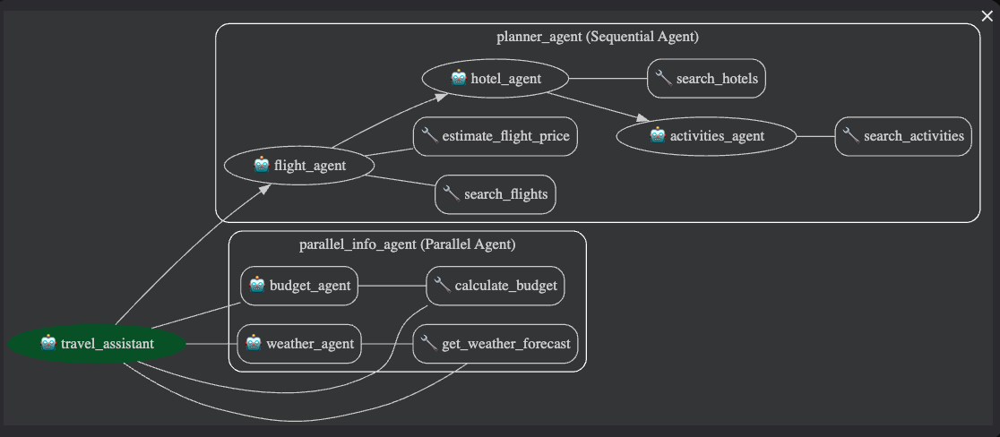

# Assistant de Voyage Multi-Agents — Google ADK
## BALAZUC Mathéo

> Projet réalisé dans le cadre du TP ADK.  
> Système multi-agents en Python permettant de planifier un voyage complet en langage naturel.

## Description du projet

L'assistant de voyage est un système multi-agents orchestré qui répond à des requêtes concernant la planification de voyages. L'utilisateur peut demander des informations sur les vols, les hôtels, les activités, la météo et le budget pour une destination donnée.

Le système repose sur un **agent orchestrateur central** (`travel_assistant`) qui détecte l'intention de l'utilisateur via une analyse par mots-clés, puis délègue automatiquement les tâches aux agents spécialisés appropriés. Chaque agent leaf est court-circuité via `before_model_callback`, il appelle directement son outil Python sans passer par le LLM, ce qui garantit des réponses claires et rapides même avec un modèle local (Ollama/Mistral).

---

## Architecture multi-agents

### Schéma



### Agents et rôles

| Agent | Type | Rôle |
|---|---|---|
| `travel_assistant` | `LlmAgent` (root) | Orchestrateur central : détecte l'intention, route vers les sous-agents, assemble le récapitulatif final |
| `planner_agent` | `SequentialAgent` | Exécute en séquence : vols -> hôtels -> activités |
| `parallel_info_agent` | `ParallelAgent` | Exécute en parallèle : budget + météo simultanément |
| `flight_agent` | `LlmAgent` (leaf) | Recherche de vols entre deux villes |
| `hotel_agent` | `LlmAgent` (leaf) | Recherche d'hôtels à destination |
| `activities_agent` | `LlmAgent` (leaf) | Recherche d'activités touristiques |
| `budget_agent` | `LlmAgent` (leaf) | Calcul du budget total estimé |
| `weather_agent` | `LlmAgent` (leaf) | Prévisions météo pour la destination |

### Flux de délégation

- **Planification complète** (`je veux aller à X`) -> `planner_agent` (séquentiel : vol -> hôtel -> activités)
- **Météo seule** (`quelle météo à X`) -> `weather_agent` via `AgentTool`
- **Budget seul** (`quel budget pour X nuits`) -> `budget_agent` via `AgentTool`
- **Météo + Budget** (`combien ça coûte et quelle météo`) -> `parallel_info_agent` (parallèle)

---

## Contraintes techniques satisfaites

| # | Contrainte | Implémentation |
|---|---|---|
| 1 | Minimum 3 agents | 8 agents distincts (`travel_assistant`, `flight_agent`, `hotel_agent`, `activities_agent`, `budget_agent`, `weather_agent`, `planner_agent`, `parallel_info_agent`) |
| 2 | Au moins 3 tools custom | 6 outils Python dans `my_tools.py` : `search_flights`, `estimate_flight_price`, `search_hotels`, `search_activities`, `calculate_budget`, `get_weather_forecast` |
| 3 | 2 Workflow Agents différents | `SequentialAgent` (`planner_agent`) + `ParallelAgent` (`parallel_info_agent`) |
| 4 | State partagé | `InMemorySessionService` avec `output_key` sur chaque agent leaf (`flight_results`, `hotel_results`, `activities_results`, `budget_summary`, `weather_info`, `final_travel_plan`) |
| 5 | Les 2 mécanismes de délégation | `transfer_to_agent` (pour `planner_agent` et `parallel_info_agent`) + `AgentTool` (pour `budget_agent` et `weather_agent` exposés comme outils directs du root) |
| 6 | Au moins 2 callbacks | `before_model_callback` (court-circuit des leaf agents + filtre anti-hallucination + routage forcé) + `after_model_callback` (neutralisation des function_calls inventés + nettoyage JSON) + `after_agent_callback` (suivi `completed_agents` + assemblage du récapitulatif final) |
| 7 | Runner programmatique | `main.py` instancie `InMemorySessionService`, crée une session avec état initial, puis `Runner(agent=root_agent, ...)` en boucle interactive |
| 8 | Démo fonctionnelle | Fonctionne via `python main.py` (terminal) et `adk web` (interface de debug ADK) |

---

## Choix techniques

### Court-circuit des leaf agents via `before_model_callback`

Les modèles locaux (Mistral via Ollama) ont tendance à inventer des noms d'outils ou à reformater les résultats en JSON. Pour garantir des réponses déterministes, le `before_model_callback` intercepte chaque appel LLM des agents leaf et appelle directement la fonction Python correspondante, sans jamais interroger le LLM. Résultat : zéro consommation de tokens pour les agents leaf, et formatage garanti.

### Extraction par règles plutôt que par LLM

La destination, l'origine et le nombre de nuits sont extraits du message utilisateur par des fonctions regex/règles (`extraire_ville`, `extraire_origine`, `extraire_nuits`). Ces valeurs alimentent le state partagé de façon fiable, indépendamment de la qualité de compréhension du modèle local.

### Filtre anti-hallucination

Le `after_model_callback` compare chaque `function_call` émis par le LLM contre la liste `OUTILS_AUTORISES`. Les appels inventés (`response`, `format_response`, `budget_summary` utilisé comme outil, etc.) sont neutralisés avant d'atteindre ADK, évitant les erreurs en cascade.

### Séparation root / leaf dans les callbacks

Le `before_model_callback` est partagé entre tous les agents. Pour éviter que les leaf agents réécrasent la destination avec le contenu `"Context: ..."` injecté par ADK, seul le `travel_assistant` (root) extrait depuis `llm_request`. Les leaf agents lisent uniquement le state.

---

### Configuration

Créer le fichier `tp-adk/my_agent/.env` :

```env
ADK_MODEL_PROVIDER=ollama
ADK_MODEL_NAME=ollama/mistral
```
---

## Lancement

```bash
cd tp-adk

# Mode terminal
python main.py

# Mode interface web ADK
adk web
```

Pour `adk web`, ouvrir [http://localhost:8000](http://localhost:8000) dans le navigateur et sélectionner `my_agent`.

---

## Exemples de requêtes

### Planification complète

```
Je veux aller 4 nuits à Tokyo depuis Paris pour 2 personnes.
```
-> Lance `planner_agent` (vols -> hôtels -> activités en séquence)

```
Planifie un voyage à Rome depuis Nice pour 3 nuits en août.
```
-> Lance `planner_agent` avec extraction automatique de l'origine, la destination et la durée

### Météo

```
Quelle météo à Barcelone en septembre ?
```
-> Lance `weather_agent` directement via `AgentTool`

```
Il fait quel température à Tokyo en janvier ?
```

### Budget

```
Quel budget pour 5 nuits à Paris ?
```
-> Lance `budget_agent` directement via `AgentTool`

### Météo + Budget en parallèle

```
Combien coûte un séjour de 4 nuits à Lisbonne depuis Nice et quelle météo en juillet ?
```
-> Lance `parallel_info_agent` (budget + météo simultanément)
