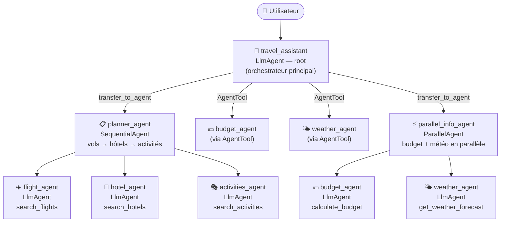

# 🌍 Travel Assistant — Système Multi-Agents ADK

Assistant de voyage intelligent basé sur **Google ADK**, orchestrant plusieurs agents spécialisés pour planifier des voyages complets : vols, hôtels, activités, budget et météo.

---

## Description du projet

Le Travel Assistant est un système multi-agents qui prend en charge la planification complète d'un voyage à partir d'une simple requête en langage naturel. L'utilisateur décrit son voyage (destination, dates, nombre de voyageurs) et le système orchestre automatiquement plusieurs agents spécialisés pour fournir un plan détaillé.

---

## Architecture multi-agents



---

## Contraintes techniques couvertes

| # | Contrainte | Implémentation |
|---|-----------|----------------|
| 1 | ≥ 3 LlmAgent distincts | `flight_agent`, `hotel_agent`, `activities_agent`, `budget_agent`, `weather_agent`, `travel_assistant` |
| 2 | ≥ 3 tools custom | `search_flights`, `estimate_flight_price`, `search_hotels`, `search_activities`, `calculate_budget`, `get_weather_forecast` |
| 3 | 2 Workflow Agents différents | `SequentialAgent` (`planner_agent`) + `ParallelAgent` (`parallel_info_agent`) |
| 4 | State partagé | `output_key` sur chaque agent + variables d'état dans les instructions du `root_agent` |
| 5 | 2 mécanismes de délégation | `sub_agents` / `transfer_to_agent` → `planner_agent` ; `AgentTool` → `budget_agent`, `weather_agent` |
| 6 | ≥ 2 callbacks de types différents | `before_model_callback` (`before_llm_callback`) + `after_agent_callback` sur tous les agents |
| 7 | Runner programmatique | `main.py` avec `Runner` + `InMemorySessionService` + état initial partagé |
| 8 | Démo fonctionnelle | Fonctionne avec `adk web` et `python main.py` |

---

## Structure du projet

```
tp-adk/
├── my_agent/
│   ├── __init__.py          # from . import agent
│   ├── agent.py             # Définition de tous les agents (root_agent obligatoire)
│   ├── tools/
│   │   └── travel_tools.py  # 6 outils custom Python
│   └── .env                 # Configuration modèle (ne pas committer)
├── main.py                  # Runner programmatique
├── tests/
│   └── travel_tests.test.json
├── .gitignore
└── README.md
```

---

## Installation

### Pré-requis

- Python 3.10+
- [Ollama](https://ollama.com) installé localement
- VS Code recommandé

### Étapes

```bash
# 1. Cloner le projet
git clone <url-du-repo>
cd projet-multi-agents-adk

# 2. Créer et activer l'environnement virtuel
python -m venv .venv
source .venv/bin/activate        # Mac / Linux
# .venv\Scripts\activate.bat     # Windows CMD
# .venv\Scripts\Activate.ps1     # Windows PowerShell

# 3. Installer Google ADK
pip install google-adk

# 4. Installer Ollama et le modèle
curl -fsSL https://ollama.com/install.sh | sh   # Mac/Linux
ollama pull mistral                              # Télécharger le modèle

# 5. Configurer le fichier .env
# my_agent/.env :
ADK_MODEL_PROVIDER=ollama
ADK_MODEL_NAME=ollama/mistral
```

> ⚠️ Ne jamais committer le fichier `.env` — il est dans le `.gitignore`.

---

## Lancement

### Interface web (recommandé pour la démo)

```bash
cd /chemin/vers/projet-multi-agents-adk
adk web tp-adk
```

Puis ouvrir [http://127.0.0.1:8000](http://127.0.0.1:8000) dans le navigateur.

### Terminal interactif

```bash
cd tp-adk
python main.py
```

---

## Exemples de requêtes pour tester le système

### Planification complète
```
Je veux aller à Tokyo depuis Paris du 15 au 22 juillet pour 2 personnes.
```
→ Active le `planner_agent` (SequentialAgent) : vols → hôtels → activités

```
Planifie un voyage à Rome pour 3 nuits en août.
```
→ Idem, avec extraction automatique des paramètres

### Météo uniquement
```
Quelle météo à Barcelone en septembre ?
```
→ Active le `weather_agent` via `AgentTool`

### Budget uniquement
```
Quel serait le budget pour 5 nuits à Amsterdam ?
```
→ Active le `budget_agent` via `AgentTool`

### Infos en parallèle
```
Donne-moi le budget et la météo pour un voyage à Lisbonne en juillet.
```
→ Active le `parallel_info_agent` (ParallelAgent) : budget + météo simultanément

---

## Modèles Ollama compatibles

| Modèle | RAM min. | Recommandé pour |
|--------|----------|-----------------|
| `gemma2:2b` | 4 Go | Tests rapides / vieux laptops |
| `llama3.2` | 4 Go | Équilibre vitesse/qualité |
| `mistral` | 8 Go | Meilleure qualité (recommandé) |

Pour changer de modèle, modifier `my_agent/.env` et remplacer `ollama/mistral` par le modèle souhaité.
